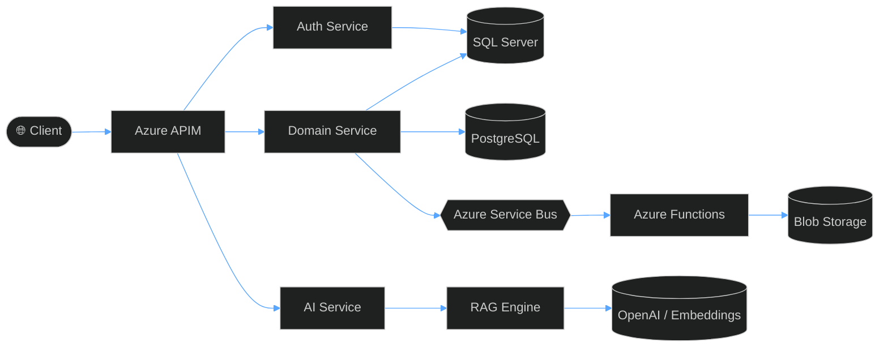

<!-- ╔═══════════════════════════════════════════════════════════╗ -->
<!-- ║   RUSTAM PULATOV — GitHub Profile (Maximum Overdrive)     ║ -->
<!-- ╚═══════════════════════════════════════════════════════════╝ -->

<a href="https://github.com/Warhammer2000">
  
</a>

<h3 align="center">
  
</h3>

<p align="center">
  
  
  
</p>


## 🧑‍💻 About Me


```yaml
name:       Rustam Pulatov
role:       .NET Backend Developer @ Vention
location:   Tashkent, Uzbekistan
working:    Remote · EU Business Hours (UTC+5)
focus:      High-load systems · Microservices
            Azure · AI/LLM tooling
open_to:    B2B contracts with EU/EMEA teams
languages:  English · Русский · Oʻzbek
```

- 🔭 Currently building **AI-powered internal tooling** & **high-throughput file pipelines** on Azure
- 🌱 Sharpening **System Design**, **distributed systems**, and **applied LLM engineering**
- 🎮 Past life: shipped engine-level features for **Space Engineers** (5M+ players) in C# / C++
- 💬 Ask me about **.NET 8, ASP.NET Core, EF Core, Azure (Functions / Service Bus / APIM), RAG**
- 📫 Reach me: [`rustam.r2005@gmail.com`](mailto:rustam.r2005@gmail.com) · [`rustampulatovwh@gmail.com`](mailto:rustampulatovwh@gmail.com)

<br clear="both" />


## 🏆 Highlights

<p align="center">
  
  
  
  
</p>


## 🛠️ Tech Stack

<details open>
<summary><strong>⚙️&nbsp;&nbsp;Core Backend & Cloud</strong></summary>
<br />
<p align="left">
  
</p>
</details>

<details open>
<summary><strong>🗄️&nbsp;&nbsp;Databases</strong></summary>
<br />
<p align="left">
  
  
  
</p>
</details>

<details open>
<summary><strong>🤖&nbsp;&nbsp;AI / ML</strong></summary>
<br />
<p align="left">
  
  
  
  
  
  
</p>
</details>

<details open>
<summary><strong>🏛️&nbsp;&nbsp;Architecture & Practices</strong></summary>
<br />
<p align="left">
  
  
  
  
  
  
  
</p>
</details>

<details>
<summary><strong>🧰&nbsp;&nbsp;Also Worked With</strong></summary>
<br />
<p align="left">
  
  
</p>
</details>


## 🏗️ What I Build




## 📜 Certifications

<p align="center">
  <a href="https://learn.microsoft.com/en-us/credentials/certifications/azure-developer/">
    
  </a>
  <a href="https://learn.microsoft.com/en-us/credentials/certifications/azure-fundamentals/">
    
  </a>
  <br />
  <a href="#">
    
  </a>
  <a href="#">
    
  </a>
</p>


## 📊 GitHub Stats

<p align="center">
  
  
</p>

<p align="center">
  
  
</p>

<p align="center">
  
  
</p>

<p align="center">
  
</p>

<p align="center">
  
</p>

### 🌆 My Year in 3D

<p align="center">
  
</p>

### 🧬 Deep Stats — Powered by Metrics

<p align="center">
  
</p>

<p align="center">
  
  
</p>


## 🎮 Watch My GitHub Play Games

> Each animation below is **auto-generated daily from my real contribution graph** by GitHub Actions. Same data — three different games. Pick your fighter.

### 🐍 Snake

<p align="center">
  <picture>
    <source media="(prefers-color-scheme: dark)" srcset="https://raw.githubusercontent.com/Warhammer2000/Warhammer2000/output/github-contribution-grid-snake-dark.svg" />
    <source media="(prefers-color-scheme: light)" srcset="https://raw.githubusercontent.com/Warhammer2000/Warhammer2000/output/github-contribution-grid-snake.svg" />
    
  </picture>
</p>

### 🟡 Pac-Man

<p align="center">
  <picture>
    <source media="(prefers-color-scheme: dark)" srcset="https://raw.githubusercontent.com/Warhammer2000/Warhammer2000/output-pacman/pacman-contribution-graph-dark.svg" />
    <source media="(prefers-color-scheme: light)" srcset="https://raw.githubusercontent.com/Warhammer2000/Warhammer2000/output-pacman/pacman-contribution-graph.svg" />
    
  </picture>
</p>

### 🧱 Breakout

<p align="center">
  <picture>
    <source media="(prefers-color-scheme: dark)" srcset="https://raw.githubusercontent.com/Warhammer2000/Warhammer2000/github-breakout/images/breakout-dark.svg" />
    <source media="(prefers-color-scheme: light)" srcset="https://raw.githubusercontent.com/Warhammer2000/Warhammer2000/github-breakout/images/breakout-light.svg" />
    
  </picture>
</p>


## 💭 Dev Quote of the Day

<p align="center">
  
</p>


## 🌐 Connect

<p align="center">
  <a href="https://www.linkedin.com/in/rustam-pulatov-92abbb251/">
    
  </a>
  <a href="mailto:rustam.r2005@gmail.com">
    
  </a>
  <a href="mailto:rustampulatovwh@gmail.com">
    
  </a>
</p>

<p align="center">
  <em>⚡ Open to remote B2B engagements with EU/EMEA teams · Let's build something at scale.</em>
</p>


